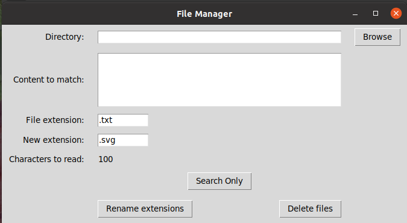
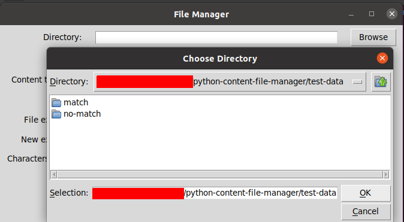
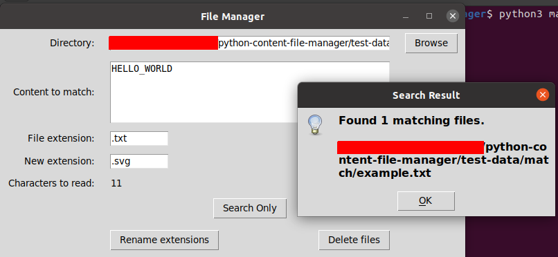
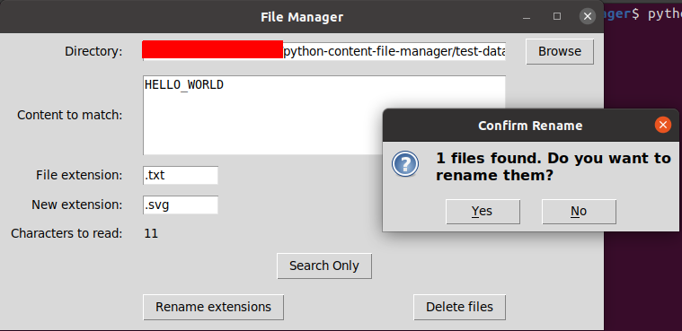
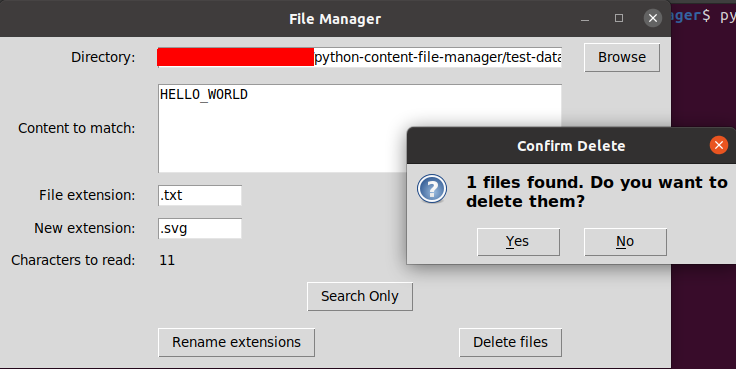

# python-content-file-manager

A simple desktop GUI tool built with **Python + Tkinter** to **search files by content** and **rename or delete them** inside a directory (recursively).

---

## What this tool does

- Select a folder
- Search files by **text content**
- Works **recursively** in all subfolders
- Rename file extensions
- Delete matched files
- Preview search results without modifying files

---

## Screenshots (step by step)

### 1. Empty main application
The application when it starts.



---

### 2. Browse and select a directory
Choose the folder containing files to test (example: `test-data`).



---

### 3. Search only (no changes)
Click **Search** to preview matches.

Result: `Found 1 matching files`



---

### 4. Rename extensions
Click **Rename extensions** to change the file extension of matched files.

Confirmation dialog:
`1 files found. Do you want to rename them?`



---

### 5. Delete files
Click **Delete Files** to remove matched files.

Confirmation dialog:
`1 files found. Do you want to delete them?`



---

## How to run

```bash
python main.py
```
---

## Requirements:

- Python 3.x

---

## Test data (recommended)

Use test folder in the project root:

```bash
test-data/
├── match/
│   └── example.txt
├── no-match/
│   └── example.txt
```

---

#### `match/example.txt`

---

```bash
HELLO_WORLD
This file should be detected.
```
---

#### `no-match/example.txt`

---

```bash
This file should not be detected.
```

---

This files areused to test searching, renaming, and deleting safely.


## Safety note
- **Search** = **no changes**
- **Rename** = **irreversible**
- **Delete** = **permanent**

Always test using sample files first.

## License

MIT License